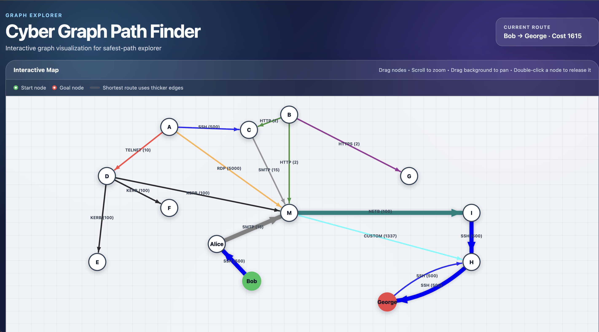

# Cyber Graph Path Finder (CGPF)

# Algorithm Used Dijkstra

A small Python + Flask + D3.js application for visualizing weighted graphs and finding the shortest (safest) path using Dijkstra's algorithm.

The graph is loaded from a text map file, processed in Python, and displayed as an interactive draggable graph in the browser.



## Features

- Dijkstra shortest-path calculation
- Graph definitions stored in text files
- Named path types with default weights and colors
- Optional per-edge weight overrides
- Multiple paths between the same two nodes
- Interactive D3 graph
- Drag-and-drop nodes
- Zoom and pan
- Start and goal node highlighting
- Shortest-path highlighting

# To install

```bash
pip install flask
```

## Run

```bash
python3 app.py maps/map.txt
```

Then open the address shown by Flask in your browser, typically:

```text
http://127.0.0.1:8000
```

## Map format

A map file starts by defining the start and goal nodes:

```text
START A
GOAL H
```

Each connection is then written as:

```text
NODE_A NODE_B Path Type
```

For example:

```text
A B Blue Road
A D Express Route
D M Trail
M H Dirt Road
```

The default weight for each path type is defined in `path_type.py`.

You can optionally override the default weight for an individual connection by adding a number at the end:

```text
M G Blue Road 5
```

This means the connection from `M` to `G` uses the `Blue Road` path type but has a cost of `5` instead of its normal default.

## Example map

```text
START Bob
GOAL George

Alice Bob SSH
A C SSH
A D TELNET
A M RDP

B C HTTP
B M HTTP
B G HTTPS

C M SMTP

D M KERB
D F KERB
D E KERB

M I NETB
M I NETB
M H CUSTOM 1337

George H SSH
I H SSH
Alice M SMTP
```

Connections are treated as directional, so:

```text
A B Blue Road
```

creates a path between both `A -> B`

## Path types

Each entry contains:

```text
Internal ID, Display Name, Default Weight, Display Color
```

For example:

```python
TYPE_B = ("TELNET", 10, "red")
```

means:

- Internal Python identifier: `TYPE_B`
- Map/display name: `TELNET`
- Default cost: `10`
- Graph color: `red`

Users only need to use the display name in the map file:

```text
A B Express Route
```

## Project structure

```text
project/
├── app.py
├── dijkstra.py
├── map_loader.py
├── node.py
├── path_type.py
├── maps/
│   └── map.txt
├── static/
│   └── d3.min.js
└── templates/
    └── index.html
```

## Graph controls

- **Drag a node** to move and pin it.
- **Double-click a node** to release it back into the force simulation.
- **Scroll** to zoom.
- **Drag the background** to pan around the graph.
- Thicker edges indicate the shortest route found by Dijkstra.


# Example runs are in examples folder

# Access types

Right now types supported are the following, you can modify the path_type.py file to add more
```
    TYPE_A = ("SSH", 500, "blue")
    TYPE_B = ("TELNET", 10, "red")
    TYPE_C = ("HTTP", 2, "green")
    TYPE_D = ("HTTPS", 2, "purple")
    TYPE_F = ("RDP", 5000, "orange")
    TYPE_G = ("SMB", 5000, "pink")
    TYPE_H = ("CUSTOM", 1337, "cyan")
    TYPE_I = ("POP3", 5, "brown")
    TYPE_J = ("SMTP", 15, "gray")
    TYPE_K = ("KERB", 100, "black")
    TYPE_L = ("NETB", 100, "teal")
    TYPE_M = ("DNS", 51, "magenta")
    TYPE_N = ("CVE", 9999, "magenta")
```